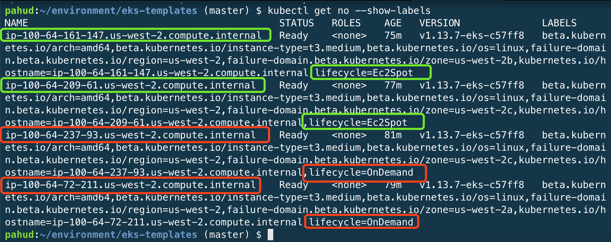
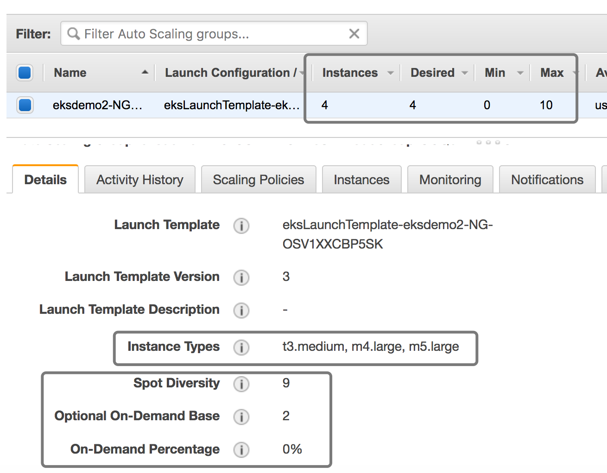

# Amazon EKS结合Amazon EC2 Spot

这个章节说明**Amazon EKS**结合**AWS EC2 Spot Instances**的通用做法与最佳实践。


## 什么是Amazon EC2 Spot

Amazon EC2 Spot 实例让您可以利用 AWS 云中未使用的 EC2 容量。与按需实例的价格相比，使用 Spot 实例最高可以享受90% 的折扣。您可以将 Spot 实例用于各种无状态、容错或者灵活的应用程序，例如大数据、容器化工作负载、CI/CD、Web服务器、高性能计算 (HPC) 以及其他测试和开发工作负载。Spot 实例与 Auto Scaling、EMR、ECS、CloudFormation、Data Pipeline 和 AWS Batch 等 AWS 服务紧密集成，因此您可以选择如何启动和维护 Spot 实例上运行的应用程序。

更多介绍请参考[官方文件](https://aws.amazon.com/cn/ec2/spot/?nc1=f_ls)说明。


## Amazon EKS如何结合Amazon EC2 Spot

由于Kubernetes能维护部署的状态，因此特别适合搭配Spot来打造一个兼具高可用与费用优化的Kubernetes集群，我们会利用**Auto Scaling Group**[多个实例类型与购买选项的新特性](https://docs.aws.amazon.com/zh_cn/autoscaling/ec2/userguide/asg-purchase-options.html)，将一定数量的on-demand实例与spot实例混合在一个**Auto Scaling Group**当中，除了保证具有一定的基线数量(baseline)由on-demand支撑之外，整个集群的横向扩展则由spot与指定比例的on-demand来进行扩展。


## 范例架构

下面这张图说明整个Amazon EKS结合Spot的整体架构


### 其中包含了几个重点：

1. 这里我们用一个ASG(Auto Scaling Group)来创建一个nodegroup，并且注册到Amazon EKS控制平面中(control plane)
2. 这个ASG由若干数量的on-demand与spot组成
3. spot一旦面临关机事件，会触发一个关机事件处理机制(termination handling)，提前对spot实例进行node draining，确保上面运行的pod可以提前被重新调度(reschedule)到其他节点。

接下来我们就来实际操作

## Amazon EKS集群创建

我们可以使用eksctl来创建一个混合的集群

首先，创建一个`cluster.yaml`文档，内容如下：

```yaml
---
apiVersion: eksctl.io/v1alpha5
kind: ClusterConfig

metadata:
    name: eksdemo
    region: ap-northeast-1

nodeGroups:
    - name: ng-1
      minSize: 4
      maxSize: 8
      instancesDistribution:
        instanceTypes: ["t3.small", "t3.medium", "t3.large"] # At least two instance types should be specified
        onDemandBaseCapacity: 2
        onDemandPercentageAboveBaseCapacity: 0
        spotInstancePools: 2
```

接着执行：

```bash
$ eksctl create cluster -f cluster.yaml
```

如此就可以在`ap-northeast-1` region创建一个名为`eksdemo`的EKS集群，同时建立起一个名为`ng-1`的nodegroup，当中由多种instance types组成，其中OnDemand基线(baseline)为2，意味着保证会有两台on-demand实例，而其他的实例则由ondemand+spot组成，但由于我们定义了`onDemandPercentageAboveBaseCapacity`为0, 意味着额外需要的两台实例(minSize-onDemandBaseCapacity)全部由spot来满足。

更多相关参数的说明请参考 [AWS文件](https://docs.aws.amazon.com/autoscaling/ec2/userguide/asg-purchase-options.html) 

更多cluster YAML配置范例请参考 `eksctl` [github](https://github.com/weaveworks/eksctl/tree/master/examples)


## 使用eks-templates模版创建

除了使用`eksctl`之外，我们也可以透过[pahud/eks-templates](https://github.com/pahud/eks-templates)专案来创建这样的混合集群，**pahud/eks-templates**使用100%的cloudformation模版，并且提供丰富的特性。

https://github.com/pahud/eks-templates


## 验证集群

透过`kubectl get no —show-labels`列出所有节点，可以看到ondemand与spot各自带上了不同的`lifecycle` label。



因此可以透过label select的方式列出指定label的节点。


打开EC2 console，查看Auto Scaling Group，会看到相应的配置。



## 部署eks-lambda-drainer

Spot实例当面临资源回收，强迫被关机的时候，系统会提前两分钟收到通知，我们可以借由CloudWatch Event捕捉到这个通知信息出发一个外部调度的Lambda function对这个节点进行node draining。 eks-lambda-drainer专案可以帮助我们部署一个完全serverless独立于Kubernetes集群之外的无服务器时间响应handler，并且监听整个VPC内的spot关机信号，一旦提前两分钟获得关机信号就会对这个节点进行`kubectl drain`操作，确保节点上吗的Pod能被及时重新调度到其他节点上运行。


关于**eks-lambda-drainer**的部署方式，请参考Github

https://github.com/pahud/eks-lambda-drainer


## 测试spot关机事件处理

一旦**eks-lambda-drainer**部署完成，当spot准备关机的时候，eks-lambda-drainer会开始进行相应处理，从Lambda log可以看到如下的信息，表示确实对node节点进行了kubectl drain的操作。


## 结语

Amazon EKS结合Amazon EC2 Spot是一个非常好的组合，常见的部署模式是把重要的controller或agent指定部署到on demand节点，而其他应用则部署到spot节点，甚至也可以全部都部署到spot节点。只要在ASG里面选择多种节点类型，并且同时选择至少三个AZ，如此ASG就会尽可能维护所需要的节点数量保证一定的高可用性。


## 公开案例

知名在线旅游服务商**Skyscanner**在**This is My Architecture**系列影片当中揭露了他们在AWS上面构建Kubernetes集群，横跨全球多个地理区，多个集群，尖峰时间支撑每秒60-75K QPS，以及每个月8千万个月独立用户，<u>**全部100%使用EC2 Spot构建K8S节点**</u>。

**SkyScanner: Building Highly-Available, Multi-Region Kubernetes Clusters on 100% Amazon EC2 Spot**
https://www.youtube.com/watch?v=99nNHsbwBpg

